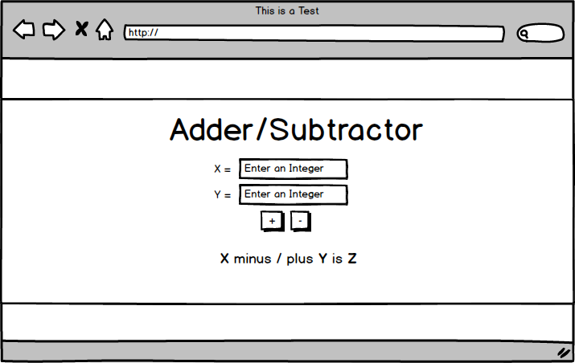

# Preview - 

- http://www.backwardsteps.com/adder-subtractor/

# Assignment

In this assignment you'll need to build a simple static web page that allows a user to add and subtract two numbers. Building this app will demonstrate your compentency with web basics. 

You will need to implement this sketch as a single, static web page.

The app has two inputs where the user is prompted to supply integers. There are add and subtract buttons. When the user enters two numbers and clicks add or subtract, they see the results of the aritmetic operation in the area with the text "X minus / plus Y is Z". 

To complete this challenge, you must:

*	Achieve the layout indicated in the sketch. The main UI components should be centered in a container div, and it should be differentiated from the background and have a top margin. We'll leave it up to you to choose colors for the background and container div.
*	You'll need to write JavaScript to handle adding and subtracting user inputs, and manipulating the DOM to display the results
*	The app should handle incorrect or missing inputs. If the user supplies a non integer value for X or Y, the app should give feedback on this. 
*	Users should be able to change X and Y and click the add or subtract button to see new results, without reloading the web page.
*	You should use Git and GitHub to save your app. When you've completed the challenge, please push your commit up to github.com, create a gh-pages branch to host the page, and share a link to the repo and the live page with your mentor, who will let you know if you've passed the challenge. If you need instructions on how to host static web pages using gh-pages branches, follow [this guide](https://pages.github.com/). To get the relevant instructions, select the "Project Site" and "Start from Scratch" options.
