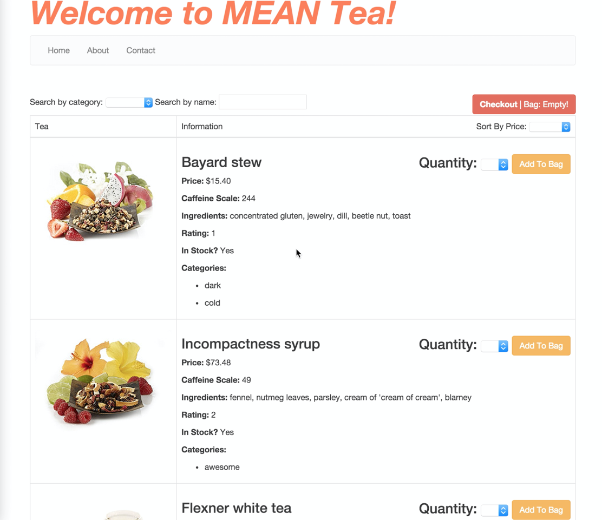

# Angular Shopping Cart App

### Features

- Search by name
- Search by category with drop down list
- Table with column for image, and tea information
- Quantity drop down number list
- Add to bag button
- New items added to bag default to qty of 1, if no qty is selected
- Checkout button
- Checkout/bag starts empty, then updates with number of items
- Tea information section has:
    - Price, Caffeine Scale, Ingredients, Rating
    - In Stock? - shows `Yes` or `No` when True/False respectively
    - Categories - goes through categories list and displays each one
- Checkout page
   - Order total
   - Lists each item that was added from the previous page, and includes its quantity
   - Ability to edit quantity
   - Editing quantity updates the sub-total and order total
   - Ability to remove a product, which then updates the order total
   - Items in checkout show the caffeine scale, ingredients, rating, and sub-total

### Sample Data

```json
[
    {
        "_id": "55c8ee82152165d244b98300",
        "name": "Bayard stew",
        "ingredients": "concentrated gluten, jewelry, dill, beetle nut, toast",
        "caffeineScale": 244,
        "price": 1540,
        "inStock": true,
        "rating": 1,
        "imageUrl": "http://s7d5.scene7.com/is/image/Teavana/32664_d?$cimg$",
        "__v": 0,
        "categories": [ "dark", "cold"]
    },

    {
        "_id": "55c8ee82152165d244b98301",
        "name": "Incompactness syrup",
        "ingredients": "fennel, nutmeg leaves, parsley, cream of 'cream of cream', blarney",
        "caffeineScale": 49,
        "price": 7348,
        "inStock": true,
        "rating": 2,
        "imageUrl": "http://s7d5.scene7.com/is/image/Teavana/32303_d?$cimg$",
        "__v": 0,
        "categories": ["awesome"]
    },
    {
        "_id": "55c8ee82152165d244b98302",
        "name": "Flexner white tea",
        "ingredients": "hot sauce, iron, beetle nut, fresco, blarney, raw mashed potato",
        "caffeineScale": 38,
        "price": 4991,
        "inStock": true,
        "rating": 4,
        "imageUrl": "http://s7d5.scene7.com/is/image/Teavana/31358_d?$cimg$",
        "__v": 0,
        "categories": ["cold"]
    },
    {
        "_id": "55c8ee82152165d244b98303",
        "name": "Pressor leaf",
        "ingredients": "purina chow, flavorings, pepper, acorns, quality tallow, old sock, bay leaf",
        "caffeineScale": 153,
        "price": 5496,
        "inStock": true,
        "rating": 1,
        "imageUrl": "http://s7d5.scene7.com/is/image/Teavana/31358_d?$cimg$",
        "__v": 0,
        "categories": ["dry", "hot", "awesome"]
    },
    {
        "_id": "55c8ee82152165d244b98304",
        "name": "Flexner veggie tea",
        "ingredients": "cream of tartar, eggplant, cake, deer antler",
        "caffeineScale": 181,
        "price": 2445,
        "inStock": true,
        "rating": 1,
        "imageUrl": "http://s7d5.scene7.com/is/image/Teavana/32621_d?$cimg$",
        "__v": 0,
        "categories": ["summer"]
    },
    {
        "_id": "55c8ee82152165d244b98305",
        "name": "Topflighter malt",
        "ingredients": "botox, toast, cream of 'cream of 'cream of cream'', kitchen scraps, beef, aligator tongue, lawn clippings",
        "caffeineScale": 241,
        "price": 4486,
        "inStock": true,
        "rating": 3,
        "imageUrl": "http://s7d5.scene7.com/is/image/Teavana/31359_d?$cimg$",
        "__v": 0,
        "categories": ["dry","lucid","warm"]
    },
    {
        "_id": "55c8ee82152165d244b98306",
        "name": "Cooking mix",
        "ingredients": "flavorings, roasted mushrooms, toast, tumeric",
        "caffeineScale": 230,
        "price": 6973,
        "inStock": true,
        "rating": 3,
        "imageUrl": "http://s7d5.scene7.com/is/image/Teavana/32303_d?$cimg$",
        "__v": 0,
        "categories": ["summer"]
    },
    {
        "_id": "55c8ee82152165d244b98307",
        "name": "Cooking stew",
        "ingredients": "eggplant",
        "caffeineScale": 122,
        "price": 6003,
        "inStock": true,
        "rating": 2,
        "imageUrl": "http://s7d5.scene7.com/is/image/Teavana/31358_d?$cimg$",
        "__v": 0,
        "categories": ["dry","winter","lucid"]
    },
    {
        "_id": "55c8ee82152165d244b98308",
        "name": "Prevenient herb tea",
        "ingredients": "cream of tartar, cream of cream, kitchen scraps, flavorings",
        "caffeineScale": 196,
        "price": 1374,
        "inStock": true,
        "rating": 3,
        "imageUrl": "http://s7d5.scene7.com/is/image/Teavana/32174_d?$cimg$",
        "__v": 0,
        "categories": ["lucid","hot"]
    },
    {
        "_id": "55c8ee82152165d244b98309",
        "name": "Angular mix",
        "ingredients": "hot sauce, lawn clippings, fennel, parsley, quinine",
        "caffeineScale": 196,
        "price": 4158,
        "inStock": true,
        "rating": 2,
        "imageUrl": "http://s7d5.scene7.com/is/image/Teavana/32621_d?$cimg$",
        "__v": 0,
        "categories": ["spring", "warm","winter"]
    }
]
```

### Sample

The app should look something along the lines of this:
<br><br>
