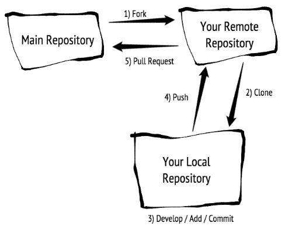

# Git Forking Workflow

1. Start by forking the main repository to create your own remote repository
1. Clone down your remote repository: `git clone SSH_CLONE_URL`
1. Develop locally
1. Once done, add files to staging: `git add -A` (taking a snapshot)
1. Add files (snapshot) to local repo: `git commit -am "commit message"`
1. Now push your local repository to the remote rep on Github: `git push origin master`
1. Finally, create a [Pull Request](https://help.github.com/articles/creating-a-pull-request/) against the main repository

