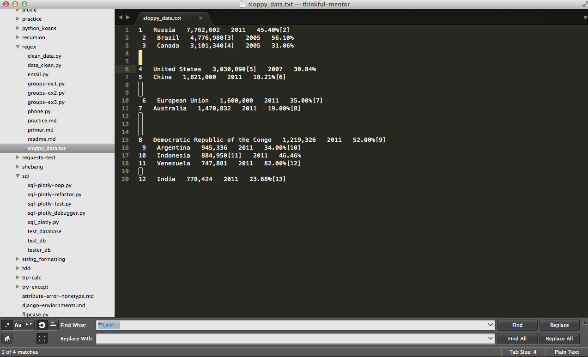
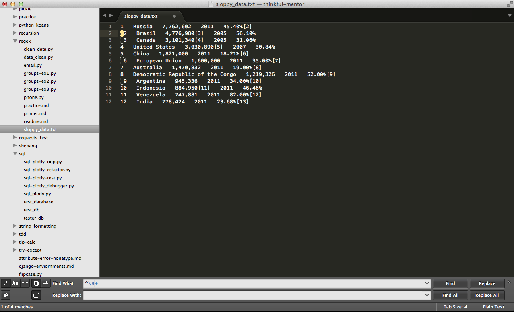
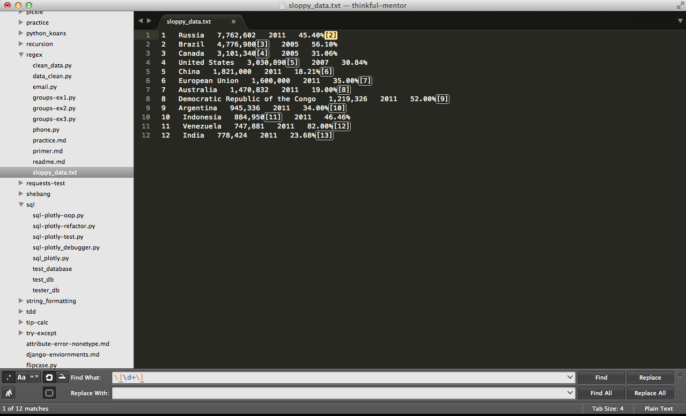
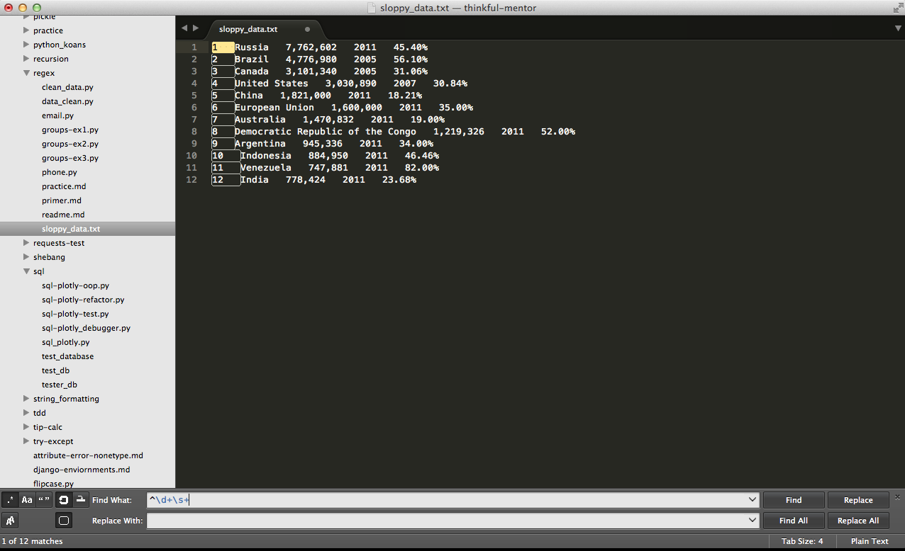

## Assignment: Data Cleansing with Regular Expressions

Your assignment is simple: Using Sublime's **Find and Replace** facilities along with regular expressions, turn *sloppy_data.txt*-

```
1   Russia   7,762,602   2011   45.40%[2]
 2   Brazil   4,776,980[3]   2005   56.10%
 3   Canada   3,101,340[4]   2005   31.06%


4   United States   3,030,890[5]   2007   30.84%
5   China   1,821,000   2011   18.21%[6]


 6   European Union   1,600,000   2011   35.00%[7]
7   Australia   1,470,832   2011   19.00%[8]


8   Democratic Republic of the Congo   1,219,326   2011   52.00%[9]
 9   Argentina   945,336   2011   34.00%[10]
10   Indonesia   884,950[11]   2011   46.46%
11   Venezuela   747,881   2011   82.00%[12]

12   India   778,424   2011   23.68%[13]
```

-into *clean_data.txt*-

```
Russia   7,762,602   2011   45.40%
Brazil   4,776,980   2005   56.10%
Canada   3,101,340   2005   31.06%
United States   3,030,890   2007   30.84%
China   1,821,000   2011   18.21%
European Union   1,600,000   2011   35.00%
Australia   1,470,832   2011   19.00%
Democratic Republic of the Congo   1,219,326   2011   52.00%
Argentina   945,336   2011   34.00%
Indonesia   884,950   2011   46.46%
Venezuela   747,881   2011   82.00%
India   778,424   2011   23.68%
```

### Steps

1. Remove blank lines

  

1. Remove spaces from the beginning of each line

  

1. Remove bracketed numbers

  

1. Remove the first column of rankings

  


