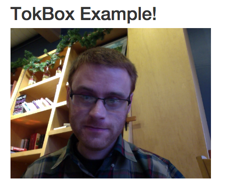

## tokbox-example

Tokbox super simple example

### Quick Start

1. Clone repo
1. Signup for [TokBox](http://tokbox.com/). Grab the "API Key" and "Secret" token, and then create a "Session ID". Add each to *main.js*.
1. Run it locally by running a simple Python server - `python -m SimpleHTTPServer`
1. Navigate to [http://localhost:8000/](http://localhost:8000/)
1. Profit!

### Example

(bad pic)

